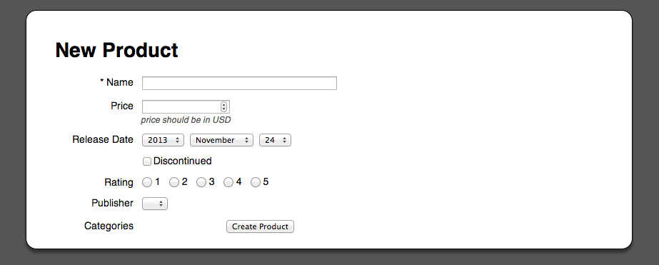

# Product_Store

By [Phil Worthington](https://github.com/philworthington).

## Description
**Product_Store** is a store that uses Simple_Form to simplify the form for creating and updating products.

## Usage

A sample application to show how products can be created and updated in the database.

## Information

Screenshots of your application below:

## Authors

* Phil Worthington (https://github.com/philworthington)
* Based on Railscasts 234 by Ryan Bates (http://railscasts.com/)

## Contributing

1. Fork it
2. Create your feature branch (`git checkout -b my-new-feature`)
3. Commit your changes (`git commit -am 'Add some feature'`)
4. Push to the branch (`git push origin my-new-feature`)
5. Create new Pull Request

